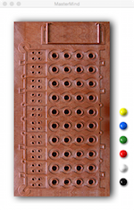
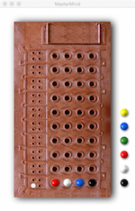
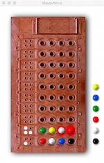
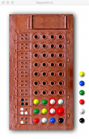
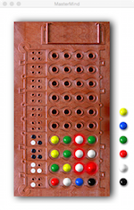
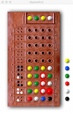

# COMP1110 Assignment 1

## Academic Honesty and Integrity

Honesty and integrity are of utmost importance. These goals are *not* at odds with being resourceful and working collaboratively. You *should* be resourceful, you should collaborate within your team, and you should discuss the assignment and other aspects of the course with others taking the class. However, *you must never misrepresent the work of others as your own*. If you have taken ideas from elsewhere or used code sourced from elsewhere, you must say so with *utmost clarity*. At each stage of the assignment you will be asked to submit a statement of originality, either as a group or as individuals. This statement is the place for you to declare which ideas or code contained in your submission were sourced from elsewhere.

Please read the ANU's [official position](http://academichonesty.anu.edu.au/) on academic honesty. If you have any questions, please ask me.

Carefully review the [statement of originality](originality.md) which you must complete.  Edit that statement and update it as you complete the assignment, ensuring that when you complete the assignment, a truthful statement is committed and pushed to your repo.

## Purpose

In this assignment is introductory, helping you gain familiarity with the basics of Java, but doing so in the context of slightly larger piece of code.

## Assignment Deliverable

The assignment is worth 5% of your total assessment, and it will be marked out of 5. However, these marks are redeamable by the exam, so if your exam mark / 20 is higher than your assignment one mark, you will get the exam mark / 20 rather than the assignment one mark. The mark breakdown is described on the [deliverables](http://cs.anu.edu.au/courses/COMP1110/deliverables.html#D1) page.

The assignment is due at 5pm Friday, week 3. Your work will be marked via your tutor accessing GitLab, so it is essential that you carefully follow instructions for setting up and maintaining your repository. You will be marked according to whatever is committed to your repository at the time of the deadline. Since the first assignment is redeemable and therefore optional, late extentions are not offered and will not be given. As always, throughout the course, if some significant circumstance arises outside of the course that you believe is affecting your capacity to complete the course, please see me and I'll do whatever I can to assist.

## Overview

The assignment is based on the classic [MasterMind board game](https://en.wikipedia.org/wiki/Mastermind_(board_game)).   The aim of the game is for the player to guess a *secret code* in a minimal number of turns.

The secret code consists of four colored pegs arranged in a particular order.  At each turn the player makes a guess at the secret code and is given feedback in the form of black and white pins.  For each peg that was guessed exactly correct, the player gets a score of one black pin.   For each peg that was guessed correctly but placed in the incorrect position, the player gets a score of one white pin.   The score pins are unordered, so offer no clue as to which of the played pegs were correct.   Each played peg can accrue at most one score pin.  For example, if the secret code contained one red peg, and the player's turn included two red pegs both in the wrong place, this will be reflected in the score by only one white pin (*not two*).

The images below show the progression of a simple game.

The game starts with the board empty and the available pegs on the right, in the margin.  In the example above, the player then makes their first guess (*red*, *white*, *blue*, *black*), and recives a score of a single white pin.   This pin indicates that just one of the pegs in the guess was the correct color, but it was in the wrong place.   The player uses this information, and takes a second guess (*green*, *yellow*, *white*, *red*).   In our version of the game, the computer notices that the second guess was a little foolish, and highlights the affected pegs in red.   The guess repeats *two* pegs from the first guess (*red* and *white*) although the score indicated that just *one* peg from the first guess could possibly be correct.   Nonetheless, the player was lucky and got three *white* pins in their score.  The player then makes another guess and receives three *black* pins.   The leftmost *white* peg in that guess was foolish because the previous turn had a *white* peg in the same spot yet the score indicated that no pegs were in the correct position, so *white* could not possibly go in that position.  The game thus highlights that *white* peg in red, as a bad move.   In their fourth guess, the player changes the rightmost peg to *green*, which results in a score of two *black* and one *white*.  The player made the same mistake with the other *white* pin, so it is again highlighted.  The player's fifth guess gets lucky and matches the secret code, which is now reveiled at the top of the game.   If the player wishes to play another game, they click on the solution at the top of the game.

Unfortunately your version of the assignment has some missing code.   While the graphical user interface is complete, some of the important logic is missing, and it is your job to complete it.
	
## Legal and Ethical Issues

First, as with any work you do, you must abide by the principles of [honesty and integrity](http://cs.anu.edu.au/courses/COMP1110/Integrity). I expect you to demonstrate honesty and integrity in everything you do.

In addition to those ground rules, you are to follow the rules one would normaly be subject to in a commercial setting. In particular, you may make use of the works of others under two fundamental conditions: a) your use of their work must be clearly acknowledged, and b) your use of their work must be legal (for example, consistent with any copyright and licensing that applies to the given material). **Please understand that violation of these rules is a very serious office.** However, as long as you abide by these rules, you are explicitly invited to conduct research and make use of a variety of sources. You are also given an explicit means with which to declare your use of other sources (via originality statements you must complete). It is important to realize that you will be assessed on the basis of your original contributions to the project. While you won't be penalized for correctly attributed use of others' ideas, the work of others will not be considered as part of your contribution. Therefore, these rules allow you to copy another student's work entirely if: a) they gave you permission to do so, and b) you acknowledged that you had done so. Notice, however, that if you were to do this you would have no original contribution and so would recieve no marks for the assigment (but you would not have broken any rules either).
	
## Evaluation Criteria

**Pass**
* Task 2

**Credit**
* Task 3

**Distinction**
* Task 4

**High Distinction**
* Task 5

**Note:** *you are not required to complete all elements of the assignment. Recall that the assignment is redeemable against the exam. The last part of the assignment is significantly harder than the others, but worth only one additional mark. I don't encourage you to spend too much time on this.*

## Tasks

1. **Fork the assignment 1 repo, clone it, share it with your tutor, explore the code, run the tests.**

    Use GitLab to fork the assignment from the class account.  See lab one if you've forgotten how to do this.   Be sure to share your repo with your tutor.   Unless you do this, your tutor will not be able to assess your work.

    Create a new project in IntelliJ that clones **your** forked repo.   Be sure that you see your university id in the URL you use to clone the repo.   See lab one if you've forgotten how to do this.

    Look through the code.   Use IntelliJ's [TODO tool](https://www.jetbrains.com/idea/help/viewing-todo-items.html) to find the three places where you need to fix the code.

    Try running the `Board` class using the `MasterMind GUI` run configuration , and you should see that the game more or less works, but unfortunately you won't have any scores or hints, which makes it not much use.

    Run the tests using the run configurations at upper right (`Task 2`, `Task 3`, etc).   They should fail (you need to fix the problems for them to pass).

2. **Fix creation of random rows.**

    The `create()` method of `MMRow` returns a constant value, which is not useful since this method is used to generate the secret code for each game.   Write code that generates a random row.   Test your code using the `Task 2` run configuration.  Once you are satisfied, update your [originality statement](originality.md), commit your work, and push to your repo.  *Note that it may turn out to be useful to have `create()` return a constant row when you're debugging other parts of this assignment because it gives you control over the secret code and makes it entirely repeatable.

3. **Fix the scoring.**

    The `getScore()` method of `MMRow` always returns an empty score.  You need to fix this so that it returns the correct score.   Write code that compares the pegs in this row against the pegs in the `secretCode`, and generates the correct score.   Test your code using the `Task 3` run configuration. Once you are satisfied, update your [originality statement](originality.md), commit your work, and push to your repo.

4.  **Add advice for wasteful moves.**

    The `advise()` method within `MMAdvice` does not return useful advice.   In this step you should add the capability to identify any pegs that were placed '*wastefully*' in the sense that the score for a previous guess showed the set of pegs in the guess could not possibly all be useful.   This situation is shown in the second move in the example above, where the player uses *white* and *red*, even though the score for the first turn shows that only one of *red*, *white*, *blue*, and *black* could be in the secret code (the last move shows that it was *white*, in fact).   Your code should identify this kind of wasteful move by marking all of the affected pegs as a `badMove` in the `MMAdvice` object returned by this method.   Test your code using the `Task 4` run configuration. Once you are satisfied, update your [originality statement](originality.md), commit your work, and push to your repo.

5. **Add further advice for bad moves**

    There are other categories of bad move.   You should enhance your implementation of `MMAdvice.advise()` to report other kinds of bad move.  Test your code using the `Task 5` run configuration.  Once you are satisfied, update your [originality statement](originality.md), commit your work, 
